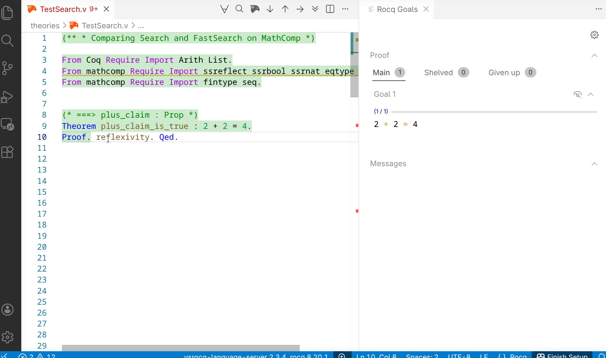

# Coq Search bar for VS Code

Interactive search panel for Coq in VS Code. Opens a side panel where you can search through Coq's environment with instant results and infinite scroll.



## Install

Download the `.vsix` from the [releases page](https://github.com/vasnesterov/coq-fastsearch-vscode/releases), then:

```
code --install-extension coq-fastsearch-vscode-0.0.1.vsix
```

Or in VS Code: Extensions panel -> `...` menu -> "Install from VSIX..."

## Usage

1. Open a `.v` file
2. Press `Ctrl+Shift+P` and select "FastSearch: Open Search Panel"
3. Wait for "Ready" status (imports from your file are loaded)
4. Type a query — same syntax as Coq's `Search` command

### Restart

Click the "Restart" button to reload imports (e.g., after adding new `Require` lines to your file).

## Requirements

- Coq 8.20
- `coqtop` must be available in `PATH`

## License

MIT
